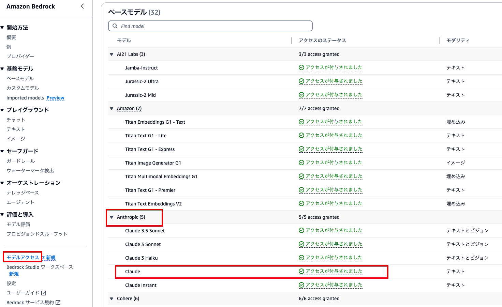

# amazon-bedrock-agents-author-information

DevelopersIO 著者の 得意分野や、どのようなペースで記事を書いているかを答えてくれるエージェント

## Note

### 1. 予め、us-east-1で、AnthropicのClaudeが利用可能になっている必要があります



### 2. 本CDKは、un-east-1でデプロイする前提で作成されております

下記の環境変数を設定してからデプロイしてください

```
% export AWS_DEFAULT_REGION=us-east-1
```

## Deploy

```
% git clone https://github.com/furuya02/amazon-bedrock-agents-author-information.git
% cd amazon-bedrock-agents-author-information

% export AWS_DEFAULT_REGION=us-east-1
% tsc
% npx aws-cdk deploy
```

## Blog

本CDKは、下記のプログを元に作成されています。

[[Agents for Amazon Bedrock] DevelopersIO 著者の 得意分野や、どのようなペースで記事を書いているかを答えてくれるエージェントを作成してみました](https://dev.classmethod.jp/articles/agents-for-amazon-bedrock-developersio-author-information/)
https://dev.classmethod.jp/articles/agents-for-amazon-bedrock-developersio-author-information/

### 以下の相違点があることをご了承ください。

- ActionGroupにおけるLambda指定は「Define with API schemas」から「Define with function details」に変更されています
- DeveloperIOのページがにリューアルしたことで、著者ページのDOM構造が変換しため、Lambdaの実装を変更しています。
- DeveloperIOのページがにリューアルしたことで、著者ページでシェア数を表示されなくなったため、レスポンス例を修正しています。
